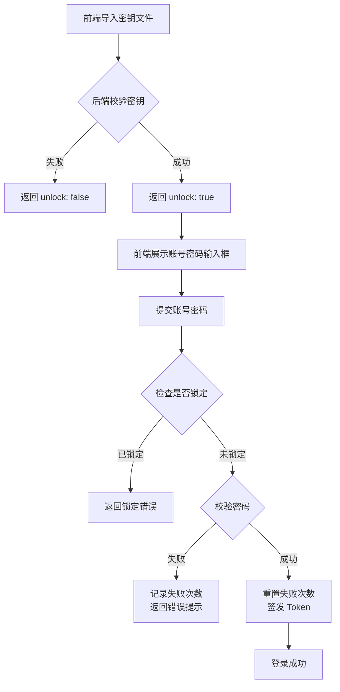
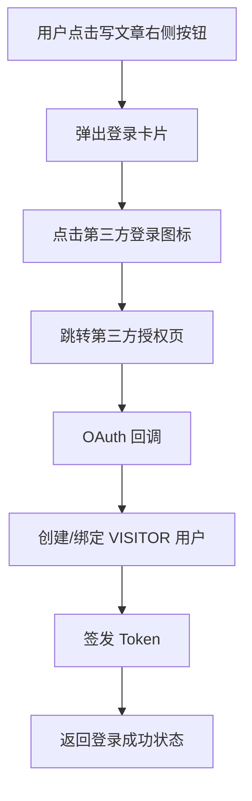
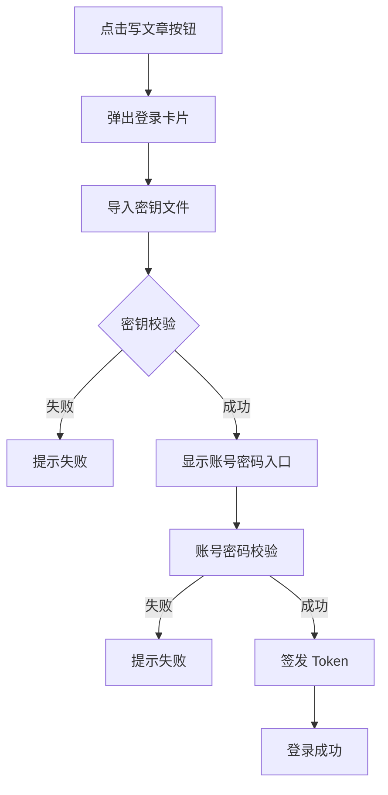
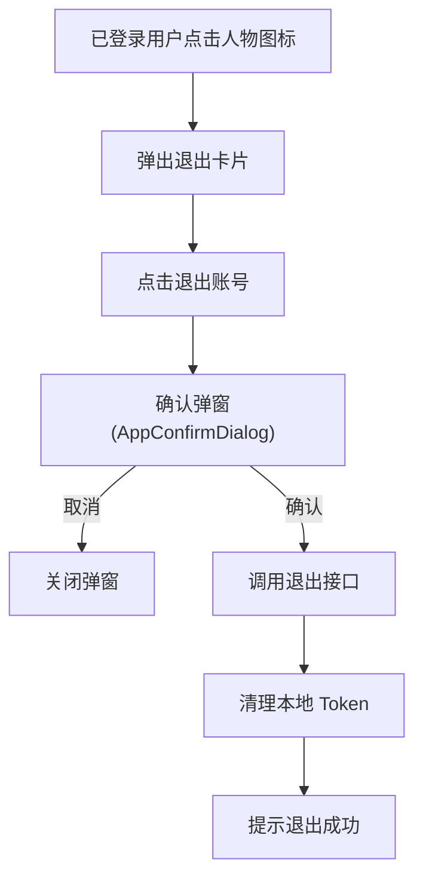
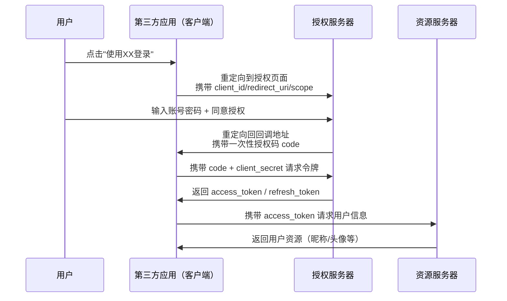

# 用户认证与权限校验 详细设计（V3.0 修订版）

## 1. 背景与范围

当前系统对增删改缺少权限控制，任何用户都可修改数据。V3.0 需要完成：

- 博主唯一写入权限（OWNER）
- 游客 OAuth 登录（为评论/留言做铺垫）
- 博主登录：账号密码
- 密钥导入仅用于"解锁博主登录入口"（不作为安全凭证）
- 首页博主头像与名称从数据库读取

不在本次范围内：评论/留言业务本身、多租户与高并发安全体系。

---

## 2. 设计目标

1. 写操作仅 OWNER 可访问，游客与匿名用户只读。
2. 博主认证链路：账号密码。
3. 游客仅 OAuth 登录，不影响博主登录逻辑。
4. 密钥导入只解锁 UI，不参与认证授权。
5. 认证使用 Spring Security + JWT（access + refresh）。
6. 补充异常场景处理：登录失败限频、并发处理等。

---

## 3. 概念定义

| 概念 | 含义 | 说明 |
|------|------|------|
| OWNER | 博主角色 | 唯一写权限 |
| VISITOR | 游客角色 | OAuth 登录，仅只读 |
| ANONYMOUS | 匿名 | 未登录，仅只读 |
| UI 解锁密钥 | 前端入口解锁 | 仅控制是否展示"博主登录入口" |
| Access Token | 短期 JWT | 访问 API 凭证 |
| Refresh Token | 长期凭证 | 换取新的 Access Token |

---

## 4. 数据库设计

### 4.0 表用途说明

- `blog_user`：用户主表，存放博主/游客基础信息与角色，用于认证、鉴权和首页博主信息展示。
- `blog_user_oauth`：OAuth 绑定表，记录游客与第三方平台账号的关联关系。
- `blog_owner_key`：博主登录入口密钥表，仅用于 UI 解锁，不参与安全认证。
- `blog_refresh_token`：Refresh Token 存储表，用于刷新 Access Token 和登出失效处理。

### 4.1 blog_user

```sql
CREATE TABLE IF NOT EXISTS `blog_user` (
  `id` BIGINT NOT NULL AUTO_INCREMENT COMMENT '主键ID',
  `role` VARCHAR(20) NOT NULL DEFAULT 'VISITOR' COMMENT '角色: OWNER/VISITOR',
  `username` VARCHAR(64) NOT NULL COMMENT '用户名',
  `password_hash` VARCHAR(255) DEFAULT NULL COMMENT '密码哈希(仅博主)',
  `email` VARCHAR(128) DEFAULT NULL COMMENT '邮箱(仅博主)',
  `avatar_url` VARCHAR(255) DEFAULT NULL COMMENT '头像URL',
  `status` TINYINT DEFAULT 1 COMMENT '状态(1正常0禁用)',
  `create_time` DATETIME DEFAULT CURRENT_TIMESTAMP COMMENT '创建时间',
  `update_time` DATETIME DEFAULT CURRENT_TIMESTAMP ON UPDATE CURRENT_TIMESTAMP COMMENT '更新时间',
  PRIMARY KEY (`id`),
  UNIQUE KEY `uk_username` (`username`)
) ENGINE=InnoDB DEFAULT CHARSET=utf8mb4 COLLATE=utf8mb4_0900_ai_ci COMMENT='用户表';
```

说明：博主昵称直接使用 `username`。首页展示取 `username + avatar_url`。

### 4.2 blog_user_oauth

```sql
CREATE TABLE IF NOT EXISTS `blog_user_oauth` (
  `id` BIGINT NOT NULL AUTO_INCREMENT COMMENT '主键ID',
  `user_id` BIGINT NOT NULL COMMENT '用户ID',
  `provider` VARCHAR(20) NOT NULL COMMENT '第三方平台: github/google/sina',
  `provider_user_id` VARCHAR(128) NOT NULL COMMENT '平台用户ID',
  `access_token` VARCHAR(255) DEFAULT NULL COMMENT 'OAuth Access Token(可选)',
  `refresh_token` VARCHAR(255) DEFAULT NULL COMMENT 'OAuth Refresh Token(可选)',
  `create_time` DATETIME DEFAULT CURRENT_TIMESTAMP COMMENT '创建时间',
  PRIMARY KEY (`id`),
  UNIQUE KEY `uk_provider_user` (`provider`, `provider_user_id`),
  KEY `idx_user_id` (`user_id`)
) ENGINE=InnoDB DEFAULT CHARSET=utf8mb4 COLLATE=utf8mb4_0900_ai_ci COMMENT='OAuth 关联表';
```

### 4.3 blog_owner_key

```sql
CREATE TABLE IF NOT EXISTS `blog_owner_key` (
  `id` BIGINT NOT NULL AUTO_INCREMENT COMMENT '主键ID',
  `key_hash` VARCHAR(255) NOT NULL COMMENT '密钥哈希',
  `enabled` TINYINT DEFAULT 1 COMMENT '是否启用(1启用0禁用)',
  `create_time` DATETIME DEFAULT CURRENT_TIMESTAMP COMMENT '创建时间',
  PRIMARY KEY (`id`)
) ENGINE=InnoDB DEFAULT CHARSET=utf8mb4 COLLATE=utf8mb4_0900_ai_ci COMMENT='博主登录入口密钥';
```

### 4.4 blog_refresh_token

```sql
CREATE TABLE IF NOT EXISTS `blog_refresh_token` (
  `id` BIGINT NOT NULL AUTO_INCREMENT COMMENT '主键ID',
  `user_id` BIGINT NOT NULL COMMENT '用户ID',
  `token_hash` VARCHAR(255) NOT NULL COMMENT 'Refresh Token 哈希',
  `expire_at` DATETIME NOT NULL COMMENT '过期时间',
  `create_time` DATETIME DEFAULT CURRENT_TIMESTAMP COMMENT '创建时间',
  PRIMARY KEY (`id`),
  KEY `idx_user_id` (`user_id`)
) ENGINE=InnoDB DEFAULT CHARSET=utf8mb4 COLLATE=utf8mb4_0900_ai_ci COMMENT='Refresh Token 表';
```

---

## 5. 后端设计

### 5.1 安全框架

- 使用 Spring Security + JWT。
- 写操作接口（POST/PUT/DELETE）仅允许 ROLE_OWNER。
- 只读接口默认开放。
- 草稿/私密数据接口仅 OWNER。

### 5.2 配置项（新增）

在 `application.yml` 中新增 `auth` 配置块：

```yaml
auth:
  owner:
    # 登录失败最大重试次数（超过后锁定一段时间）
    max-login-attempts: 5
    # 登录失败锁定时间（分钟）
    login-lock-minutes: 15
```

### 5.3 Token 规则

- Access Token：短期有效（例如 30 分钟）。
- Refresh Token：长期有效（例如 7 天）。
- Refresh Token 存库哈希，便于主动失效。

### 5.4 密钥解锁

- 前端上传密钥文件，后端校验 `blog_owner_key.key_hash`。
- 校验成功仅返回 UI 解锁标记，不下发 Token。
- 密钥校验失败不影响后续登录尝试（仅控制前端入口展示）。

### 5.5 登录流程设计

#### 5.5.1 博主登录流程



#### 5.5.2 游客登录流程

游客登录流程保持不变，通过 OAuth 第三方登录获取 Token。

### 5.6 新增类与方法清单

#### 5.6.1 新增/调整类

| 类名 | 职责 | 说明 |
|------|------|------|
| `AuthController` | 认证相关接口入口 | 调整部分方法 |
| `OAuthController` | 第三方登录跳转与回调 | 保持不变 |
| `SiteController` | 站点信息接口（博主头像与名称） | 保持不变 |
| `UserController` | 当前登录用户信息接口 | 保持不变 |
| `AuthService` | 认证与 Token 签发逻辑 | 调整登录逻辑 |
| `OAuthService` | 第三方登录用户绑定与创建 | 保持不变 |
| `TokenService` | Access/Refresh Token 生成、校验与刷新 | 保持不变 |
| `OwnerKeyService` | 密钥文件校验 | 保持不变 |
| `UserService` | 用户查询与角色判断 | 保持不变 |
| `JwtAuthFilter` | JWT 解析与安全上下文注入 | 保持不变 |
| `SecurityConfig` | Spring Security 配置（鉴权规则与过滤器） | 保持不变 |
| `UserPrincipal` | 当前登录用户模型 | 保持不变 |
| `OwnerProfileVO` | 首页博主信息返回模型 | 保持不变 |
| `JwtProperties` | JWT 配置属性（`config.properties` 包） | 保持不变 |
| `RoleType` | 角色类型枚举（OWNER/VISITOR/ANONYMOUS） | 保持不变 |
| `HashUtils` | SHA-256 哈希工具类 | 保持不变 |
| **`AuthProperties`** | **认证配置属性** | **新增**：读取 `auth.owner.*` 配置 |
| **`LoginAttemptService`** | **登录尝试计数服务** | **新增**：记录失败次数与锁定状态 |

#### 5.6.2 新增/调整方法

| 方法 | 说明 |
|------|------|
| `AuthController#verifyOwnerKey(MultipartFile file)` | 校验密钥文件并返回 `unlock` |
| `AuthController#ownerLogin(OwnerLoginDTO dto)` | 账号密码校验并签发 Token |
| `AuthController#refreshToken(RefreshTokenDTO dto)` | 刷新 Access Token |
| `AuthController#logout(LogoutDTO dto)` | 登出并失效 Refresh Token |
| `OAuthController#authorize(String provider)` | 跳转第三方授权页 |
| `OAuthController#callback(String provider, String code, String state)` | 处理回调并签发 Token |
| `OwnerKeyService#verifyKey(byte[] content)` | 密钥哈希校验 |
| `TokenService#issueTokens(User user)` | 签发 Access/Refresh Token |
| `TokenService#refresh(String refreshToken)` | 刷新 Access Token |
| `TokenService#invalidate(String refreshToken)` | 使 Refresh Token 失效 |
| `UserService#findOwner()` | 获取博主用户 |
| `UserService#findByUsername(String username)` | 按用户名查用户 |
| `UserService#findOrCreateVisitor(OAuthUserInfo info)` | OAuth 游客绑定/创建 |
| **`AuthProperties#getOwner()`** | **获取博主认证配置** |
| **`AuthProperties.OwnerConfig#getMaxLoginAttempts()`** | **最大登录尝试次数** |
| **`AuthProperties.OwnerConfig#getLoginLockMinutes()`** | **登录失败锁定时间** |
| **`LoginAttemptService#recordFailedAttempt(String username)`** | **记录登录失败** |
| **`LoginAttemptService#isLocked(String username)`** | **检查账户是否被锁定** |
| **`LoginAttemptService#resetAttempts(String username)`** | **重置登录尝试次数** |

#### 5.6.3 实现补充说明

- SQL 文件已落在 `PersonalBlog-backend/sql/auth_module.sql`。
- OAuth 接口当前为占位实现，未配置第三方平台时返回未配置提示。
- JWT 配置使用 `JwtProperties`（`jwt.secret`/`jwt.access-expire-minutes`/`jwt.refresh-expire-days`）。
- OAuth 配置使用 `oauth.providers`（支持 `github`/`google`/`sina`）。
- `auth_module.sql` 包含博主账号与密钥哈希的初始化示例，需要替换占位值。
- **新增**：`AuthProperties` 读取 `auth.owner.*` 配置。
- **新增**：`LoginAttemptService` 使用内存 Map 记录登录失败次数（简单场景够用，后续可换 Redis）。

### 5.7 异常场景处理

| 场景 | 处理方式 |
|------|----------|
| **密码错误** | 记录失败次数，返回统一错误提示（不暴露具体原因） |
| **连续失败 N 次** | 锁定账户 `login-lock-minutes` 分钟，期间拒绝登录 |
| **Refresh Token 失效** | 返回 401，前端跳转登录页 |
| **并发登录** | 允许多设备同时登录，每个 Refresh Token 独立管理 |
| **密钥校验失败** | 返回 `unlock: false`，不记录失败次数（仅控制 UI） |

---

## 6. 接口设计

所有接口返回统一 `Result<T>`：

```json
{
  "code": 200,
  "message": "success",
  "data": {}
}
```

### 6.1 密钥解锁

**POST /api/auth/owner/key-verify**

Request: `multipart/form-data`，字段名 `file`

Response:
```json
{
  "code": 200,
  "message": "success",
  "data": {
    "unlock": true
  }
}
```

### 6.2 博主账号密码登录

**POST /api/auth/owner/login**

Request:
```json
{
  "username": "owner",
  "password": "plainPassword"
}
```

Response（登录成功）:
```json
{
  "code": 200,
  "message": "success",
  "data": {
    "token": "jwt.access.token",
    "refreshToken": "refresh.token"
  }
}
```

Response（账户被锁定）:
```json
{
  "code": 40101,
  "message": "账户已被锁定，请 15 分钟后再试",
  "data": {}
}
```

### 6.3 OAuth 登录

**GET /api/auth/oauth/{provider}/authorize**

Response: 302 跳转到第三方授权页。

**GET /api/auth/oauth/{provider}/callback**

Response:
```json
{
  "code": 200,
  "message": "success",
  "data": {
    "token": "jwt.access.token",
    "refreshToken": "refresh.token"
  }
}
```

### 6.4 Token 刷新

**POST /api/auth/refresh**

Request:
```json
{
  "refreshToken": "refresh.token"
}
```

Response:
```json
{
  "code": 200,
  "message": "success",
  "data": {
    "token": "jwt.access.token",
    "refreshToken": "refresh.token"
  }
}
```

### 6.5 登出

**POST /api/auth/logout**

Request:
```json
{
  "refreshToken": "refresh.token"
}
```

Response:
```json
{
  "code": 200,
  "message": "success",
  "data": {}
}
```

### 6.6 用户信息与站点信息

**GET /api/user/me**

Response:
```json
{
  "code": 200,
  "message": "success",
  "data": {
    "id": 1,
    "role": "OWNER",
    "username": "owner",
    "avatarUrl": "https://..."
  }
}
```

**GET /api/site/owner-profile**

Response:
```json
{
  "code": 200,
  "message": "success",
  "data": {
    "username": "owner",
    "avatarUrl": "https://..."
  }
}
```

---

## 7. 前端设计

**前端设计总体规则**：要求设计的界面必须符合网站的整体风格

### 7.1 登录卡片布局

- 屏幕中央水平拉长圆角卡片，弱对比边框，融入背景。
- 头像圆形置顶居中，半截破框悬浮。
- 文本居中："登录到 [博主昵称]"。
- OAuth 按钮水平排列：GitHub/Google/Sina，显示对应地第三方的图标。
- 最右侧显示"导入密钥"图标。
- 点击登录按钮，平滑地弹出登录界面
- 无需关闭按钮，点击卡片外任意区域自动关闭登录卡片
- 需具备良好的错误提示信息。提示信息复用AppNoticeDialog组件
- 第三方登录的图片可以爬取官方的favicon.ico

样式遵循网站的整体风格，布局参考：


### 7.2 交互流程

1. 未登录展示 OAuth 图标 + 导入密钥图标。
2. 导入密钥成功后，显示账号密码登录入口。
3. 账号密码通过 -> 直接签发 Token，登录成功。

### 7.2.1 写文章卡片右侧按钮区

- 登录与退出共用同一个"人物头部轮廓"图标按钮，位置在写文章按钮右侧图标区，风格与其他三个图标一致。
- 未登录时：显示第三方登录图标 + 导入密钥图标。
- 已登录时：隐藏第三方与导入密钥，仅显示"人物头部轮廓"按钮，点击后进入退出流程。

### 7.2.2 细节要求

* 只有在博主登录状态下，才显示写文章的按钮	

### 7.3 游客登录流程（Mermaid）



### 7.4 博主登录流程（Mermaid）



### 7.5 退出账号流程（Mermaid）



### 7.6 OAuth 2.0 认证流程



### 7.7 前端代码实现 TODO List

#### 1. 基础设施与状态管理
- [x] **Pinia Store**: 建立 `useAuthStore`，管理 `accessToken`、`refreshToken` 和 `user` 对象，实现状态持久化。
- [x] **Request 拦截器升级**: 
    - **请求拦截**: 自动在 Header 注入 `Authorization: Bearer <token>`。
    - **响应拦截**: 捕获 `401` 错误，实现自动调用刷新令牌接口并无感重试。
- [x] **API 封装**: 
    - `auth.ts`: 密钥校验、博主登录、登出、OAuth 链接。
    - `user.ts`: 获取当前登录用户信息 (`/api/user/me`)。
    - `site.ts`: 获取博主公开信息 (`/api/site/owner-profile`)。

#### 2. 核心认证组件
- [x] **`AppLoginDialog.vue`**: 
    - 实现水平拉长圆角毛玻璃卡片，顶部半截破框悬浮头像。
    - 实现两步切换流：1. OAuth/导入密钥入口 -> 2. 账号密码输入。
    - 集成 `AppNoticeDialog` 处理错误反馈。

#### 3. 页面逻辑与权限适配
- [x] **首页 (`HomeView.vue`) 改造**:
    - **数据动态化**: 从接口获取博主昵称、头像，替换现有写死的硬编码。
    - **写文章卡片**: 在原社交图标行（Github/Bilibili等）末尾新增"人物轮廓"图标按钮。
    - **交互逻辑**: 
        - 未登录态：点击人物图标弹出 `AppLoginDialog`。
        - 已登录态：点击人物图标弹出 `AppConfirmDialog` 确认退出。
    - **写文章按钮**: 仅在博主（OWNER角色）登录状态下展示。
- [x] **追番管理 (`AnimeView.vue`)**:
    - 保持现有所有功能按钮可见。
    - **详情弹窗优化**: 若当前非博主登录，对集数格子、日期输入、删除按钮等进行只读/禁用处理。
- [x] **创作模式 (`WriteView.vue`)**:
    - 组件挂载时检查博主权限，非博主尝试进入则弹出提示并自动跳转回首页。

#### 4. 全局初始化
- [x] **`main.ts`**: 注册 Pinia 插件。
- [x] **`App.vue`**: 挂载全局 `AppLoginDialog` 组件。

---

## 8. 安全与异常处理

- 密钥仅 UI 解锁，不产生 Token。
- 登录失败错误不暴露具体原因。
- Refresh Token 可主动失效（登出或异常）。
- **新增**：登录失败限频，连续 N 次失败后锁定账户。

---

## 9. 验收标准

1. 未登录或 VISITOR 无法调用写接口。
2. OWNER 必须账号密码才能获取 Token。
3. 密钥仅影响前端入口，无法绕过认证。
4. 首页头像/名称来自 `blog_user`。
5. **新增**：连续登录失败 N 次后账户被锁定。

---

## 10. 兼容性说明

- OAuth 仅影响游客登录，博主不走第三方登录。
- 所有新增接口均为新增路径，不影响现有 API。
