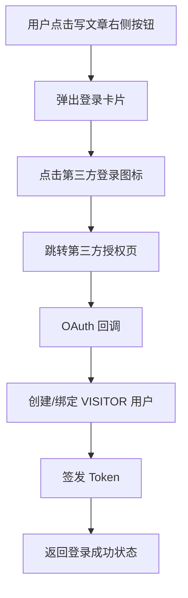
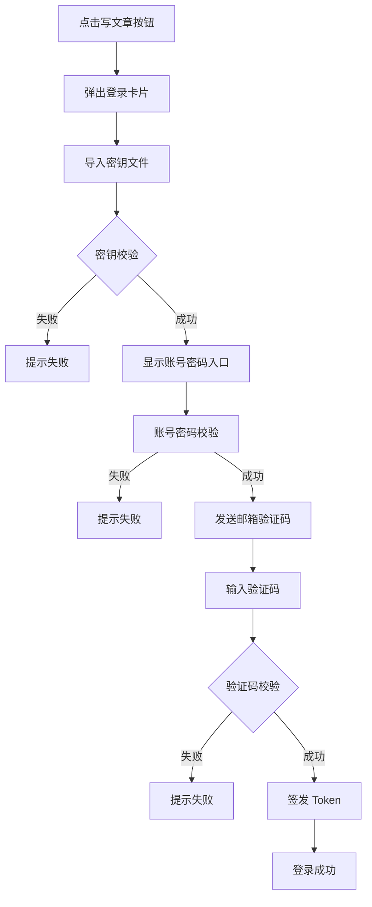
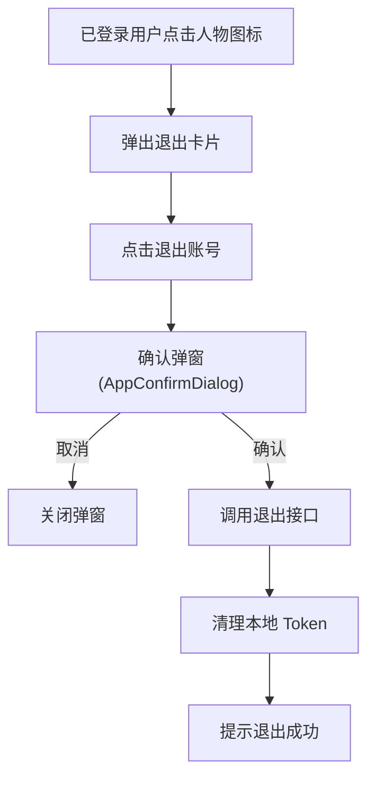

# 用户认证与权限校验 详细设计

## 1. 背景与范围

当前系统对增删改缺少权限控制，任何用户都可修改数据。V3.0 需要完成：

- 博主唯一写入权限（OWNER）
- 游客 OAuth 登录（为评论/留言做铺垫）
- 博主登录：账号密码 + 邮箱验证码二次校验
- 密钥导入仅用于“解锁博主登录入口”（不作为安全凭证）
- 首页博主头像与名称从数据库读取

不在本次范围内：评论/留言业务本身、多租户与高并发安全体系。

---

## 2. 设计目标

1. 写操作仅 OWNER 可访问，游客与匿名用户只读。
2. 博主认证链路：账号密码 + 邮箱验证码。
3. 游客仅 OAuth 登录，不影响博主登录逻辑。
4. 密钥导入只解锁 UI，不参与认证授权。
5. 认证使用 Spring Security + JWT（access + refresh）。

---

## 3. 概念定义

| 概念 | 含义 | 说明 |
|------|------|------|
| OWNER | 博主角色 | 唯一写权限 |
| VISITOR | 游客角色 | OAuth 登录，仅只读 |
| ANONYMOUS | 匿名 | 未登录，仅只读 |
| UI 解锁密钥 | 前端入口解锁 | 仅控制是否展示“博主登录入口” |
| Access Token | 短期 JWT | 访问 API 凭证 |
| Refresh Token | 长期凭证 | 换取新的 Access Token |

---

## 4. 数据库设计

### 4.0 表用途说明

- `blog_user`：用户主表，存放博主/游客基础信息与角色，用于认证、鉴权和首页博主信息展示。
- `blog_user_oauth`：OAuth 绑定表，记录游客与第三方平台账号的关联关系。
- `blog_owner_key`：博主登录入口密钥表，仅用于 UI 解锁，不参与安全认证。
- `blog_refresh_token`：Refresh Token 存储表，用于刷新 Access Token 和登出失效处理。
- `blog_email_code`：邮箱验证码表，用于博主登录邮箱二次校验。

### 4.1 blog_user

```sql
CREATE TABLE IF NOT EXISTS `blog_user` (
  `id` BIGINT NOT NULL AUTO_INCREMENT COMMENT '主键ID',
  `role` VARCHAR(20) NOT NULL COMMENT '角色: OWNER/VISITOR',
  `username` VARCHAR(64) NOT NULL COMMENT '用户名',
  `password_hash` VARCHAR(255) DEFAULT NULL COMMENT '密码哈希(仅博主)',
  `email` VARCHAR(128) DEFAULT NULL COMMENT '邮箱(仅博主)',
  `email_verified` TINYINT DEFAULT 0 COMMENT '邮箱是否验证(0否1是)',
  `avatar_url` VARCHAR(255) DEFAULT NULL COMMENT '头像URL',
  `status` TINYINT DEFAULT 1 COMMENT '状态(1正常0禁用)',
  `create_time` DATETIME DEFAULT CURRENT_TIMESTAMP COMMENT '创建时间',
  `update_time` DATETIME DEFAULT CURRENT_TIMESTAMP ON UPDATE CURRENT_TIMESTAMP COMMENT '更新时间',
  PRIMARY KEY (`id`),
  UNIQUE KEY `uk_username` (`username`)
) ENGINE=InnoDB DEFAULT CHARSET=utf8mb4 COLLATE=utf8mb4_0900_ai_ci COMMENT='用户表';
```

说明：博主昵称直接使用 `username`。首页展示取 `username + avatar_url`。

### 4.2 blog_user_oauth

```sql
CREATE TABLE IF NOT EXISTS `blog_user_oauth` (
  `id` BIGINT NOT NULL AUTO_INCREMENT COMMENT '主键ID',
  `user_id` BIGINT NOT NULL COMMENT '用户ID',
  `provider` VARCHAR(20) NOT NULL COMMENT '第三方平台: github/gitee/google/bilibili',
  `provider_user_id` VARCHAR(128) NOT NULL COMMENT '平台用户ID',
  `access_token` VARCHAR(255) DEFAULT NULL COMMENT 'OAuth Access Token(可选)',
  `refresh_token` VARCHAR(255) DEFAULT NULL COMMENT 'OAuth Refresh Token(可选)',
  `create_time` DATETIME DEFAULT CURRENT_TIMESTAMP COMMENT '创建时间',
  PRIMARY KEY (`id`),
  UNIQUE KEY `uk_provider_user` (`provider`, `provider_user_id`),
  KEY `idx_user_id` (`user_id`)
) ENGINE=InnoDB DEFAULT CHARSET=utf8mb4 COLLATE=utf8mb4_0900_ai_ci COMMENT='OAuth 关联表';
```

### 4.3 blog_owner_key

```sql
CREATE TABLE IF NOT EXISTS `blog_owner_key` (
  `id` BIGINT NOT NULL AUTO_INCREMENT COMMENT '主键ID',
  `key_hash` VARCHAR(255) NOT NULL COMMENT '密钥哈希',
  `enabled` TINYINT DEFAULT 1 COMMENT '是否启用(1启用0禁用)',
  `create_time` DATETIME DEFAULT CURRENT_TIMESTAMP COMMENT '创建时间',
  PRIMARY KEY (`id`)
) ENGINE=InnoDB DEFAULT CHARSET=utf8mb4 COLLATE=utf8mb4_0900_ai_ci COMMENT='博主登录入口密钥';
```

### 4.4 blog_refresh_token

```sql
CREATE TABLE IF NOT EXISTS `blog_refresh_token` (
  `id` BIGINT NOT NULL AUTO_INCREMENT COMMENT '主键ID',
  `user_id` BIGINT NOT NULL COMMENT '用户ID',
  `token_hash` VARCHAR(255) NOT NULL COMMENT 'Refresh Token 哈希',
  `expire_at` DATETIME NOT NULL COMMENT '过期时间',
  `create_time` DATETIME DEFAULT CURRENT_TIMESTAMP COMMENT '创建时间',
  PRIMARY KEY (`id`),
  KEY `idx_user_id` (`user_id`)
) ENGINE=InnoDB DEFAULT CHARSET=utf8mb4 COLLATE=utf8mb4_0900_ai_ci COMMENT='Refresh Token 表';
```

### 4.5 blog_email_code

```sql
CREATE TABLE IF NOT EXISTS `blog_email_code` (
  `id` BIGINT NOT NULL AUTO_INCREMENT COMMENT '主键ID',
  `email` VARCHAR(128) NOT NULL COMMENT '邮箱',
  `code_hash` VARCHAR(255) NOT NULL COMMENT '验证码哈希',
  `expire_at` DATETIME NOT NULL COMMENT '过期时间',
  `used` TINYINT DEFAULT 0 COMMENT '是否已使用(0否1是)',
  `create_time` DATETIME DEFAULT CURRENT_TIMESTAMP COMMENT '创建时间',
  PRIMARY KEY (`id`),
  KEY `idx_email` (`email`)
) ENGINE=InnoDB DEFAULT CHARSET=utf8mb4 COLLATE=utf8mb4_0900_ai_ci COMMENT='邮箱验证码表';
```

---

## 5. 后端设计

### 5.1 安全框架

- 使用 Spring Security + JWT。
- 写操作接口（POST/PUT/DELETE）仅允许 ROLE_OWNER。
- 只读接口默认开放。
- 草稿/私密数据接口仅 OWNER。

### 5.2 Token 规则

- Access Token：短期有效（例如 30 分钟）。
- Refresh Token：长期有效（例如 7 天）。
- Refresh Token 存库哈希，便于主动失效。

### 5.3 密钥解锁

- 前端上传密钥文件，后端校验 `blog_owner_key.key_hash`。
- 校验成功仅返回 UI 解锁标记，不下发 Token。

### 5.4 新增类与方法清单

#### 5.4.1 新增类

- `AuthController`：认证相关接口入口。
- `OAuthController`：第三方登录跳转与回调。
- `SiteController`：站点信息接口（博主头像与名称）。
- `UserController`：当前登录用户信息接口。
- `AuthService`：认证与 Token 签发逻辑。
- `OAuthService`：第三方登录用户绑定与创建。
- `EmailCodeService`：邮箱验证码生成、发送与校验。
- `TokenService`：Access/Refresh Token 生成、校验与刷新。
- `OwnerKeyService`：密钥文件校验。
- `UserService`：用户查询与角色判断。
- `JwtAuthFilter`：JWT 解析与安全上下文注入。
- `SecurityConfig`：Spring Security 配置（鉴权规则与过滤器）。
- `UserPrincipal`：当前登录用户模型。
- `OwnerProfileVO`：首页博主信息返回模型。
- `JwtProperties`：JWT 配置属性（`config.properties` 包）。
- `RoleType`：角色类型枚举（OWNER/VISITOR/ANONYMOUS）。
- `HashUtils`：SHA-256 哈希工具类。

#### 5.4.2 新增/调整方法

- `AuthController#verifyOwnerKey(MultipartFile file)`：校验密钥文件并返回 `unlock`。
- `AuthController#ownerLogin(OwnerLoginRequest req)`：账号密码校验。
- `AuthController#sendEmailCode(EmailCodeRequest req)`：发送邮箱验证码。
- `AuthController#verifyEmailCode(EmailVerifyRequest req)`：验证码校验并签发 Token。
- `AuthController#refreshToken(RefreshTokenRequest req)`：刷新 Access Token。
- `AuthController#logout(LogoutRequest req)`：登出并失效 Refresh Token。
- `OAuthController#authorize(String provider)`：跳转第三方授权页。
- `OAuthController#callback(String provider, String code, String state)`：处理回调并签发 Token。
- `OwnerKeyService#verifyKey(byte[] content)`：密钥哈希校验。
- `EmailCodeService#sendCode(String email)`：生成并发送验证码。
- `EmailCodeService#verifyCode(String email, String code)`：校验验证码有效性。
- `TokenService#issueTokens(User user)`：签发 Access/Refresh Token。
- `TokenService#refresh(String refreshToken)`：刷新 Access Token。
- `TokenService#invalidate(String refreshToken)`：使 Refresh Token 失效。
- `UserService#findOwner()`：获取博主用户。
- `UserService#findByUsername(String username)`：按用户名查用户。
- `UserService#findOrCreateVisitor(OAuthUserInfo info)`：OAuth 游客绑定/创建。

#### 5.4.3 实现补充说明

- SQL 文件已落在 `PersonalBlog-backend/sql/auth_module.sql`。
- OAuth 接口当前为占位实现，未配置第三方平台时返回未配置提示。
- 邮件发送使用 `spring-boot-starter-mail`，验证码邮件为 HTML 字符串模板。
- JWT 配置使用 `JwtProperties`（`jwt.secret`/`jwt.access-expire-minutes`/`jwt.refresh-expire-days`）。

---

## 6. 接口设计

所有接口返回统一 `Result<T>`：

```json
{
  "code": 200,
  "message": "success",
  "data": {}
}
```

### 6.1 密钥解锁

**POST /api/auth/owner/key-verify**

Request: `multipart/form-data`，字段名 `file`

Response:
```json
{
  "code": 200,
  "message": "success",
  "data": {
    "unlock": true
  }
}
```

### 6.2 博主账号密码登录

**POST /api/auth/owner/login**

Request:
```json
{
  "username": "owner",
  "password": "plainPassword"
}
```

Response:
```json
{
  "code": 200,
  "message": "success",
  "data": {
    "needEmailVerify": true
  }
}
```

### 6.3 发送邮箱验证码

**POST /api/auth/owner/send-email-code**

Request:
```json
{
  "email": "owner@example.com"
}
```

Response:
```json
{
  "code": 200,
  "message": "success",
  "data": {
    "sent": true
  }
}
```

### 6.4 邮箱验证码校验并签发 Token

**POST /api/auth/owner/email-verify**

Request:
```json
{
  "email": "owner@example.com",
  "code": "123456"
}
```

Response:
```json
{
  "code": 200,
  "message": "success",
  "data": {
    "token": "jwt.access.token",
    "refreshToken": "refresh.token"
  }
}
```

### 6.5 OAuth 登录

**GET /api/auth/oauth/{provider}/authorize**

Response: 302 跳转到第三方授权页。

**GET /api/auth/oauth/{provider}/callback**

Response:
```json
{
  "code": 200,
  "message": "success",
  "data": {
    "token": "jwt.access.token",
    "refreshToken": "refresh.token"
  }
}
```

### 6.6 Token 刷新

**POST /api/auth/refresh**

Request:
```json
{
  "refreshToken": "refresh.token"
}
```

Response:
```json
{
  "code": 200,
  "message": "success",
  "data": {
    "token": "jwt.access.token",
    "refreshToken": "refresh.token"
  }
}
```

### 6.7 登出

**POST /api/auth/logout**

Request:
```json
{
  "refreshToken": "refresh.token"
}
```

Response:
```json
{
  "code": 200,
  "message": "success",
  "data": {}
}
```

### 6.8 用户信息与站点信息

**GET /api/user/me**

Response:
```json
{
  "code": 200,
  "message": "success",
  "data": {
    "id": 1,
    "role": "OWNER",
    "username": "owner",
    "avatarUrl": "https://..."
  }
}
```

**GET /api/site/owner-profile**

Response:
```json
{
  "code": 200,
  "message": "success",
  "data": {
    "username": "owner",
    "avatarUrl": "https://..."
  }
}
```

---

## 7. 前端设计

### 7.1 登录卡片布局

对齐 `ProjectDocument\V3.0\登录卡片布局.md`：

- 屏幕中央水平拉长圆角卡片，弱对比边框，融入背景。
- 头像圆形置顶居中，半截破框悬浮。
- 文本居中："登录到 [博主昵称]"。
- OAuth 按钮水平排列：GitHub/Gitee/Google/Bilibili。
- 最右侧显示“导入密钥”图标。
- 左侧外侧圆形“电源”按钮关闭弹窗。

### 7.2 交互流程

1. 未登录展示 OAuth 图标 + 导入密钥图标。
2. 导入密钥成功后，显示账号密码登录入口。
3. 账号密码通过 -> 发送邮箱验证码 -> 校验成功下发 Token。

### 7.2.1 写文章卡片右侧按钮区

- 登录与退出共用同一个“人物头部轮廓”图标按钮，位置在写文章按钮右侧图标区，风格与其他三个图标一致。
- 未登录时：显示第三方登录图标 + 导入密钥图标。
- 已登录时：隐藏第三方与导入密钥，仅显示“人物头部轮廓”按钮，点击后进入退出流程。

### 7.3 游客登录流程（Mermaid）



### 7.4 博主登录流程（Mermaid）



### 7.5 退出账号流程（Mermaid）



---

## 8. 安全与异常处理

- 密钥仅 UI 解锁，不产生 Token。
- 验证码限频（例如 60s 冷却），5 分钟有效，使用后失效。
- 登录失败错误不暴露具体原因。
- Refresh Token 可主动失效（登出或异常）。

---

## 9. 验收标准

1. 未登录或 VISITOR 无法调用写接口。
2. OWNER 必须账号密码 + 邮箱验证码才能获取 Token。
3. 密钥仅影响前端入口，无法绕过认证。
4. 首页头像/名称来自 `blog_user`。

---

## 10. 兼容性说明

- OAuth 仅影响游客登录，博主不走第三方登录。
- 所有新增接口均为新增路径，不影响现有 API。
